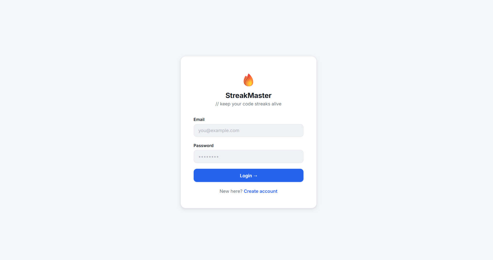
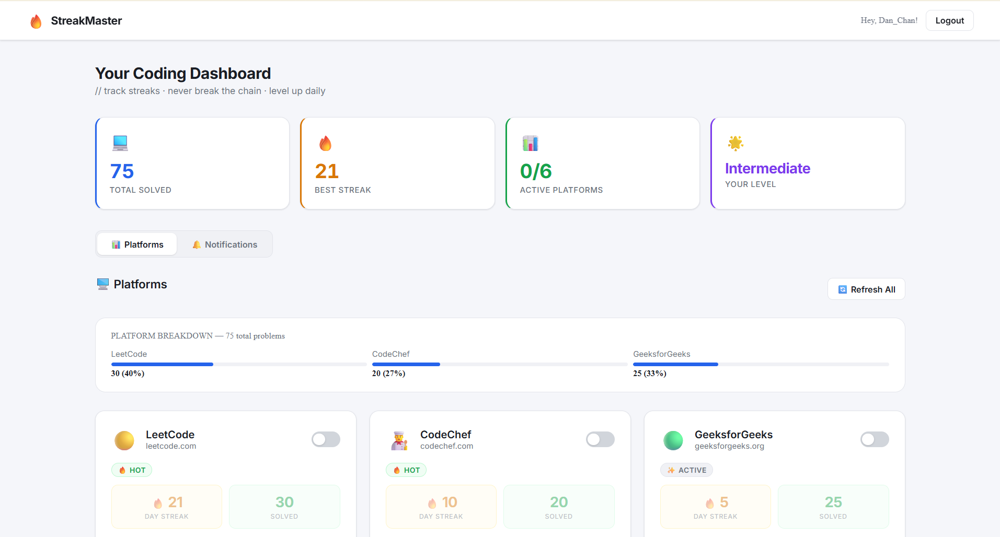
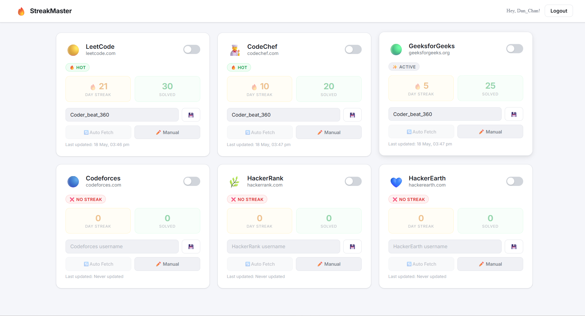
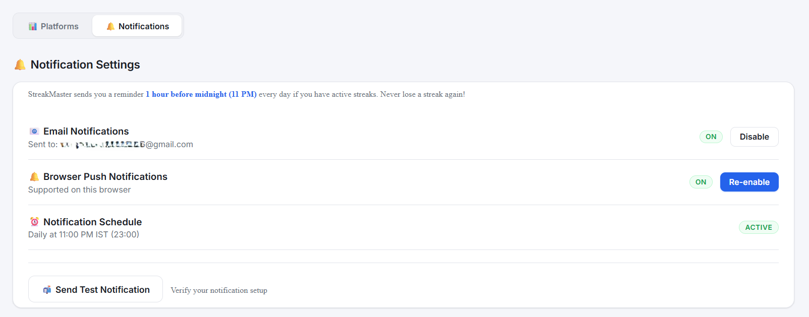

# 🔥 StreakMaster
> Never break your coding streak again.

StreakMaster tracks your coding streaks across 6 platforms and sends a **daily reminder at 11 PM** so you never lose a streak.

🌐 **Live:** [streak-tracker-bice.vercel.app](https://streak-tracker-bice.vercel.app) &nbsp;|&nbsp; ⭐ Star this repo if you find it useful!

---

## 📸 Screenshots

| Login | Dashboard |
|---|---|
|  |  |

| Platforms | Notifications |
|---|---|
|  |  |

---

## ✨ Features
- 📊 Streak + solved count for 6 coding platforms
- ⏰ Real-time midnight countdown with urgent alerts
- 📧 11 PM email + browser push notification reminder
- ✏️ Manual override for platforms without public APIs
- 🏆 Level system — Beginner → Legendary
- 🔐 JWT authentication + MongoDB storage

---

## 🔧 Platform Support

| Platform | Status |
|---|---|
| LeetCode | ✅ Automated |
| Codeforces | ✅ Automated |
| CodeChef | ✏️ Manual |
| GeeksforGeeks | ✏️ Manual |
| HackerRank | ✏️ Manual |
| HackerEarth | ✏️ Manual |

---

## 🛠️ Tech Stack
`React 18` `Node.js` `Express` `MongoDB` `JWT` `Nodemailer` `Web Push` `Node-Cron`

**Deployed on:** Vercel (frontend) · Render (backend) · MongoDB Atlas (database)

---

## 🚀 Run Locally

```bash
# Clone & install
git clone https://github.com/Vickykumar03/Streak-Tracker.git
cd Streak-Tracker
npm run install:all

# Setup environment
cp backend/.env.example backend/.env
# Fill in your values

# Start
npm run dev:backend    # Terminal 1
npm run dev:frontend   # Terminal 2
```

Open [http://localhost:3000](http://localhost:3000)

---

## 🔑 Environment Variables

Create `backend/.env` — **never commit this file**

```env
PORT=5000
MONGODB_URI=your_mongodb_uri
JWT_SECRET=your_secret_key
EMAIL_USER=your_gmail@gmail.com
EMAIL_PASS=your_app_password
VAPID_PUBLIC_KEY=your_vapid_public_key
VAPID_PRIVATE_KEY=your_vapid_private_key
VAPID_EMAIL=mailto:your_gmail@gmail.com
FRONTEND_URL=http://localhost:3000
```

> Generate VAPID keys: `cd backend && node -e "const wp=require('web-push');const k=wp.generateVAPIDKeys();console.log(k)"`

---

## 🔐 Security
- Passwords hashed with **bcryptjs** (12 rounds)
- **JWT tokens** with 30-day expiry
- `.env` excluded via `.gitignore`
- CORS restricted to frontend URL

---

## 📝 License
MIT — free to use and modify.

---
<p align="center">Built with ❤️ to keep coding streaks alive 🔥</p>
